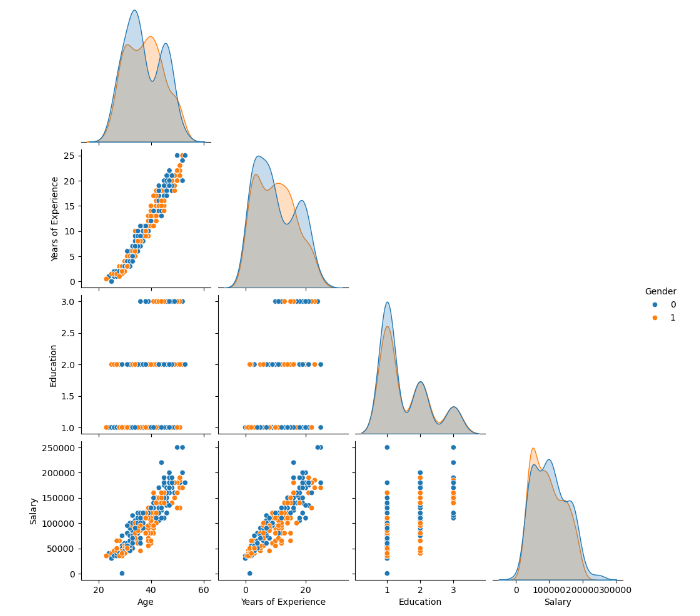
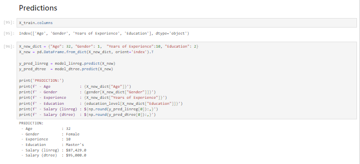

# Multi-feature-Salary-Prediction
This is a Jupyter Notebook that is comprised of a multivariate dataset that predicts the salary of an employee by building a decision tree model.  

!

[alt text](SMF2.png)

